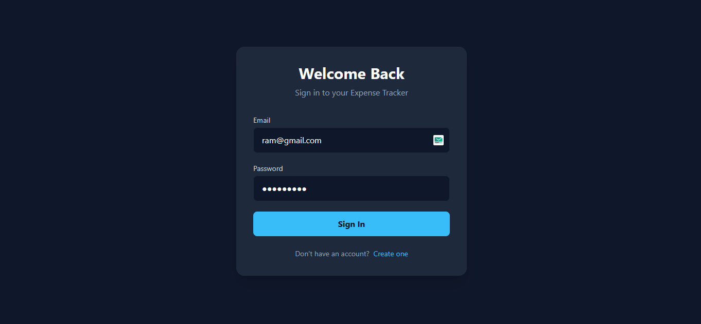
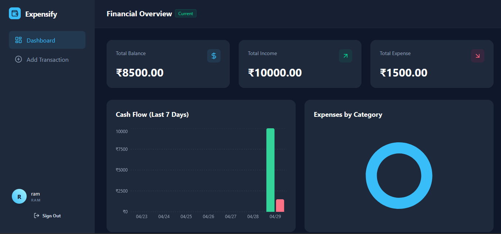
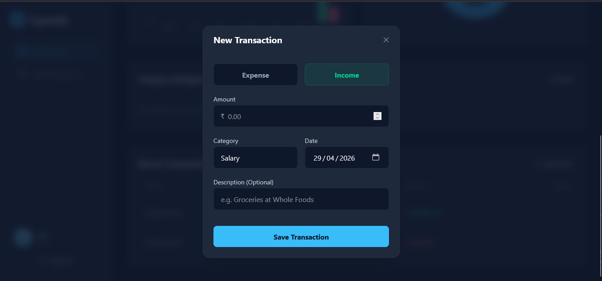

# Expense Tracker Web Application

An elegant, dark-themed expense tracker built with React, Node.js, Express, and MySQL.

### Login Page


### Dashboard


### New Transaction



## Run Instructions (Docker)

### Step 1
Install [Docker Desktop](https://www.docker.com/products/docker-desktop/) on your machine.

### Step 2
Run project using docker-compose:
```bash
docker-compose up --build -d
```

### Step 3
Access:
* **Frontend** &rarr; [http://localhost:3000](http://localhost:3000)
* **Backend API** &rarr; [http://localhost:5000](http://localhost:5000)

## AWS EC2 Deployment Guide

To deploy this application to an AWS EC2 instance (Amazon Linux 2/2023), follow these steps:

1. **Launch an EC2 Instance:** Launch an instance and configure the Security Group to allow inbound traffic on:
   - Port `22` (SSH)
   - Port `3000` (Frontend)
   - Port `5000` (Backend API - Optional)

2. **Upload the Code:** SCP or clone this repository to your EC2 instance.

3. **Run the Initialization Script:**
   ```bash
   chmod +x ec2-setup.sh
   ./ec2-setup.sh
   newgrp docker
   ```

4. **Start the Application Containerized:**
   ```bash
   docker-compose up -d --build
   ```

5. **Access the Application:** Open your browser and navigate to `http://<YOUR_EC2_PUBLIC_IP>:3000`

## Features
- **Authentication**: Secure JWT-based Login and Registration.
- **Elegant Dark Theme**: Optimized UX using Tailwind CSS (`#0f172a`, `#1e293b`, `#38bdf8`).
- **Dashboard**: Visual breakdowns using Recharts (Pie & Bar charts).
- **Transactions**: Add, edit, and delete transactions. Filters dynamically.

## Architecture
This project is configured as a Full-Stack Monorepo for deployment convenience, but logically separated via Docker:
- `src/`: React Frontend
- `backend/`: Node.js + Express Backend logic
- `server.ts`: Entrypoint for Backend
